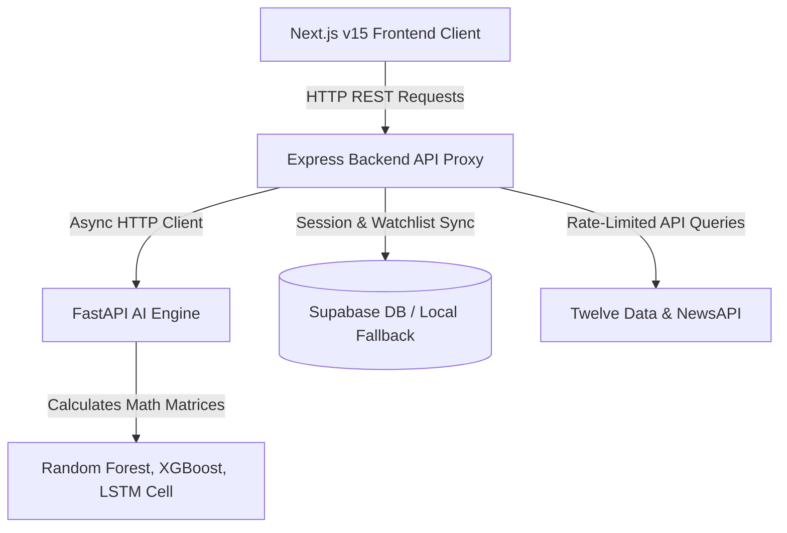

# 🎚️ AURAX AI — Institutional Gold Intelligence

> An ultra-premium, institutional-grade AI-powered trading intelligence platform focused on XAUUSD (Gold/USD). Designed to replicate the depth and feel of a billion-dollar hedge fund trading terminal.

---

## 💎 What is AURAX AI?

**AURAX AI** combines real-time market data feed parsing, algorithmic **Smart Money Concepts (SMC)** overlays, machine learning prediction models, and natural language processing (NLP) news sentiment into an integrated, glassmorphic trading terminal. 

Rather than providing vague win rates, it generates **High-Probability Market Confluences** using a weighted scoring model to help professional traders evaluate spots, blocks, and target levels.

### 🌟 Key Capabilities
*   🔮 **Ensemble AI Forecasting:** Blends custom-fit Random Forests, online XGBoost classifiers, and simulated LSTM recurrent networks for directional validation.
*   📐 **Algorithmic SMC Engine:** Scans live price feeds to detect unmitigated Order Blocks (OB), Fair Value Gaps (FVG), swing structures (BOS/CHoCH), and liquidity sweeps (SSL/BSL).
*   📰 **NLP News Sentiment Index:** Parses news headlines through a local VADER lexicon optimized for commodity volatility, geopolitical conflicts, and macroeconomic metrics (CPI, FOMC, NFP).
*   📊 **Bloomberg-Inspired Dashboard:** Premium black-and-gold styling, live interactive TradingView chart widgets, session liquidity profiles, and a real-time DXY/US10Y/SPX/Oil correlation matrix.

---

## 🛠️ How It Works (System Architecture)

AURAX AI is structured as a robust three-tier microservice architecture to decouple heavy ML processing from standard API requests and user interaction states:



### 1. FastAPI AI Engine (`ai_engine` - Port `8000`)
The brain of the platform. Written in Python, it serves clean REST endpoints for math-heavy computations:
*   **SMC Detector:** Algorithmic calculation of swing high/low pivots to identify structural breaks and market imbalances.
*   **Sentiment Analyzer:** Leverages localized sentiment dictionaries to score headline impacts from `-100` (extremely bearish) to `+100` (extremely bullish).
*   **ML Ensemble:** Chains classifiers to calculate directional probability metrics.

### 2. Express Backend Proxy (`backend` - Port `5000`)
The system coordinator. Written in Node.js, it manages:
*   **Market Feed Caching:** Throttle-caching layer for Twelve Data and Alpha Vantage quotes to avoid rate limit bans.
*   **Data Aggregation:** Queries the AI Engine to construct composite confluences.
*   **Telegram & Notification Simulator:** Dispatches high-priority alert triggers.

### 3. Next.js Frontend Terminal (`frontend` - Port `3000`)
The interface. Built using React, TypeScript, and Tailwind CSS v4, containing:
*   **Live Gold Terminal:** Ticking quote monitors, TradingView interactive candlesticks, and session timelines.
*   **User Dashboard:** Custom watchlist trackers and saved confluences.
*   **Admin Simulation Panel:** Real-time telemetry monitoring and signal dispatch consoles.

---

## 📈 Confluence Scoring Matrix

To avoid false triggers, the system compiles a **Weighted Confidence Score (%)** based on six core indicators:

| Factor | Description | Weight |
| :--- | :--- | :---: |
| **EMA Alignment** | 20m, 50m, and 200m Exponential Moving Averages trend match | **20%** |
| **Ensemble Prediction** | Directional consensus between scikit-learn models | **20%** |
| **Order Block Re-test** | Price dipping into unmitigated supply/demand zones | **15%** |
| **Liquidity Sweeps** | Sell-side (SSL) or Buy-side (BSL) range sweep and rejection | **15%** |
| **News Sentiment** | High-impact macroeconomic and geopolitical news bias | **15%** |
| **RSI Extremes** | Oversold (<30) or Overbought (>70) momentum conditions | **10%** |

---

## 🚀 Getting Started

### Prerequisites
*   Node.js (v18+)
*   Python (v3.10+)

### 1. Configure Environment Variables
Create a `.env` file in the root of the **`backend`** directory:
```env
PORT=5000
AI_ENGINE_URL=http://localhost:8000
TWELVEDATA_API_KEY=your_key
NEWSAPI_KEY=your_key
SUPABASE_URL=your_supabase_url
SUPABASE_KEY=your_supabase_anon_key
```

### 2. Run the FastAPI AI Engine
```bash
cd ai_engine
python3 -m venv venv
source venv/bin/activate
pip install -r requirements.txt
python main.py
```

### 3. Run the Express Backend
```bash
cd backend
npm install
npm start
```

### 4. Run the Next.js Frontend
```bash
cd frontend
npm install
npm run dev
```
Open `http://localhost:3000` to access the terminal.

---

## 📂 Project Structure

```
AURAX-AI/
├── ai_engine/               # FastAPI AI Processing Node
│   ├── models/              # Ensemble classifier scripts
│   ├── services/            # SMC and NLP Sentiment detectors
│   └── main.py              # Python server entry point
├── backend/                 # Express API Proxy Layer
│   ├── routes/              # Auth, Alerts, Market, and Signal routes
│   └── server.js            # Node server entry point
├── frontend/                # Next.js Terminal Interface
│   ├── src/app/             # Pages (Landing, Terminal, Dashboard, Admin)
│   └── src/components/      # UI components and layout helpers
└── .gitignore               # Excludes build assets & credentials
```

---

## ⚠️ Disclaimer

*Trading Spot Gold (XAUUSD) carries significant risk of capital loss. The analysis, prediction matrices, and confidence scores generated by AURAX AI represent high-probability statistical models and should not be treated as financial advice, guarantees of success, or risk-free signals.*
